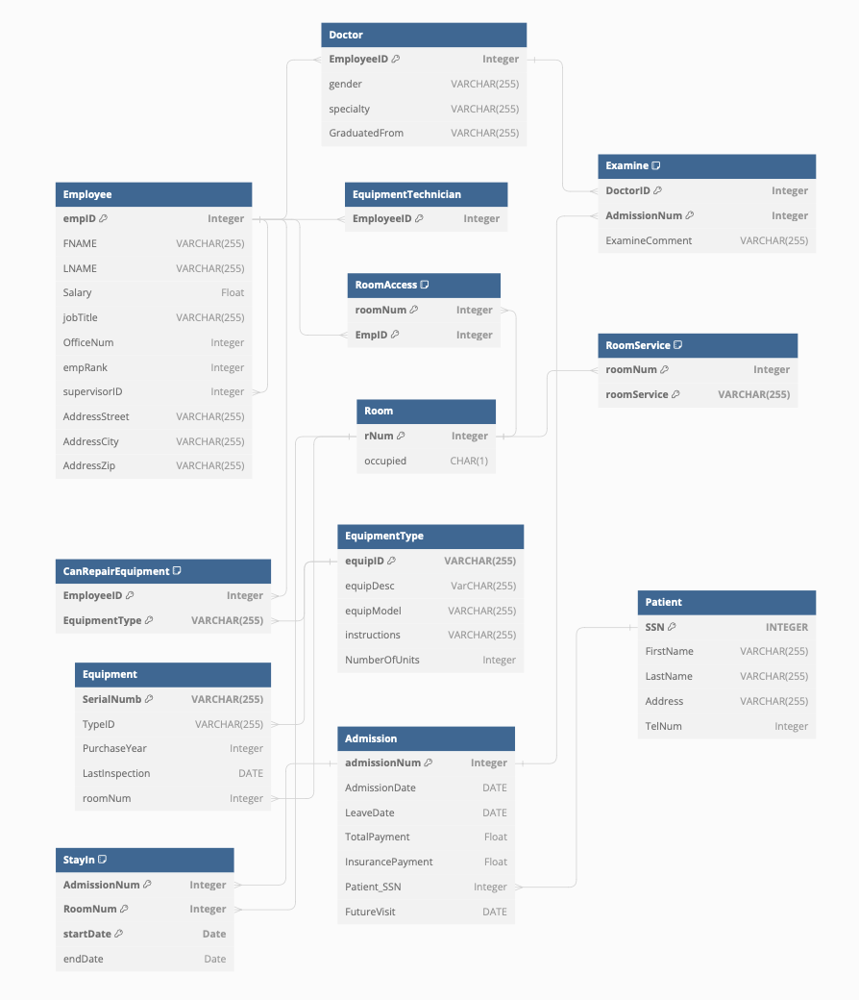

# Hospital Information System (HIS)

#### **Description:**

This `Entity-Relationship Database` schema with `Normalization` manages core hospital operations through keys representing patients, doctors, admissions, services, and finances. It facilitates efficient data retrieval, analysis, and reporting for informed decision-making. The database includes `views`, `queries`, `trigegrs`, `example data`, `Java Database Connectivity` and `test data`

#### Entity-Relationship Diagram:

#### **Technologies:**

* **Database Management System:** `Oracle's SQLDeveloper 23.1.1`
* **API Access:** Java Database Controller `JDBC`
* **Data Modeling:** Entity-Relationship `ER` model with `Normalization`

#### **Key Features:**

* **Normalized:** This `3NF` database eliminates redundancy, ensures data integrity, and boosts maintainability for flexible data management and expanded use cases.
* **Unified Patient and Doctor Profiles:** Centralized repository for demographics, **medical history diagnoses and treatment plans**.
* **Granular Admission Tracking:** Comprehensive records of admission dates, **room assignments,** **procedures,medications,** and billing details.
* **Service Catalog and Utilization:** Track various hospital services provided, **including room types, equipment,and personnel assigned**.
* **Automated Insurance Calculations:** Dynamically generate insurance payments based on pre-defined rules and procedures.
* **Flexible Querying and Reporting:** Leverage robust query engine for extracting targeted insights and generating informative reports.

#### **Usage Overview:**

* Access and interact with the database schema via dedicated applications, **SQL clients,** or programmatic interfaces.
* Employ standard Structured Query Language (SQL) commands for data manipulation,**aggregation,** and analysis.
* Leverage pre-defined views and triggers for common tasks and optimized performance.

#### **Configuration Requirements:**

* System setup and database configuration vary based on the chosen DBMS.
* Refer to the official DBMS documentation for installation and configuration guides.

#### **Example Use Cases:**

1. **Identify high-risk patients** with specific diagnoses or admission patterns using targeted queries.
2. **Analyze doctor workload** and optimize staffing through admission distribution reports.
3. **Track departmental resource utilization** for efficient budgeting and equipment allocation.
4. **Generate invoices and calculate insurance coverage** automatically based on treatment specifics.

#### **Additional Information:**

* Detailed data model diagrams and table schema descriptions are available in a separate document.
* Sample queries and reporting templates can be provided for common use cases.
* Refer to additional documentation for security measures, **data integrity practices,** and backup procedures.

#### **Triggers:**

1. **Post-Insert Doctor Visit Trigger:** `IsICUPatient` Enforces comment creation on doctor visits to patients with past ICU admissions within the current admission (utilizes JOIN operations and conditional logic).
2. **On Update Admission Payment Trigger:** `CalculateInsurancePayment` Automatically recalculates insurance payment based on the updated total payment using a pre-defined percentage formula.
3. **Employee Hierarchy Enforcement Trigger:** `HasCorrectManager` Maintains valid supervisor relationships for regular employees and division managers by enforcing rank constraints upon INSERT and UPDATE operations.
4. **Emergency Room Future Visit Trigger:** `EMCVisit` Sets the future visit date two months after an Emergency Room admission through an`AFTER INSERT` trigger utilizing date manipulation functions.
5. **Equipment Inspection Reminder Trigger:** `NewEquipment` Identifies uninspected equipment exceeding a specific time threshold and attempts assigning technicians based on availability through `CHECK` and `UPDATE` statements.

#### **JDBC Access with `Reporting.java`:**

##### Important Note: **This database utilized a private oracle server in order to utilize this JDBC you must edit the connection to your specific database connection by altering the `connection` variable however all report functions can remain the same**

* **Main Invocation and Menu System:** Uses command-line arguments for program execution and displays a menu of reporting and update options upon successful connection.
* **Patient Information Retrieval:** Upon receiving patient SSN (provided as program argument or user input),utilizes prepared statements and executes a `JOIN` query to retrieve and display relevant patient details.
* **Doctor Information Retrieval:** Similar to patient information, utilizes prepared statements and `JOIN` queries to fetch and display doctor details based on the provided ID.
* **Admission Information Retrieval:** Uses an admission number argument or user input, executes complex queries involving multiple tables and JOINs to display admission details, including room history, doctor involvement (`DISTINCT` function), and calculated insurance amount.
* **Admission Payment Update:** Prompts for admission number and new total payment, updates the relevant table rows through prepared statements, and calculates the revised insurance amount using a function call.
